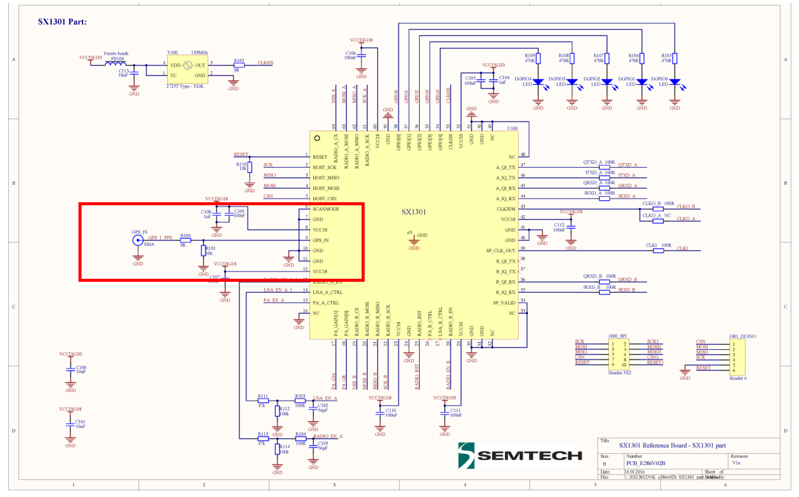
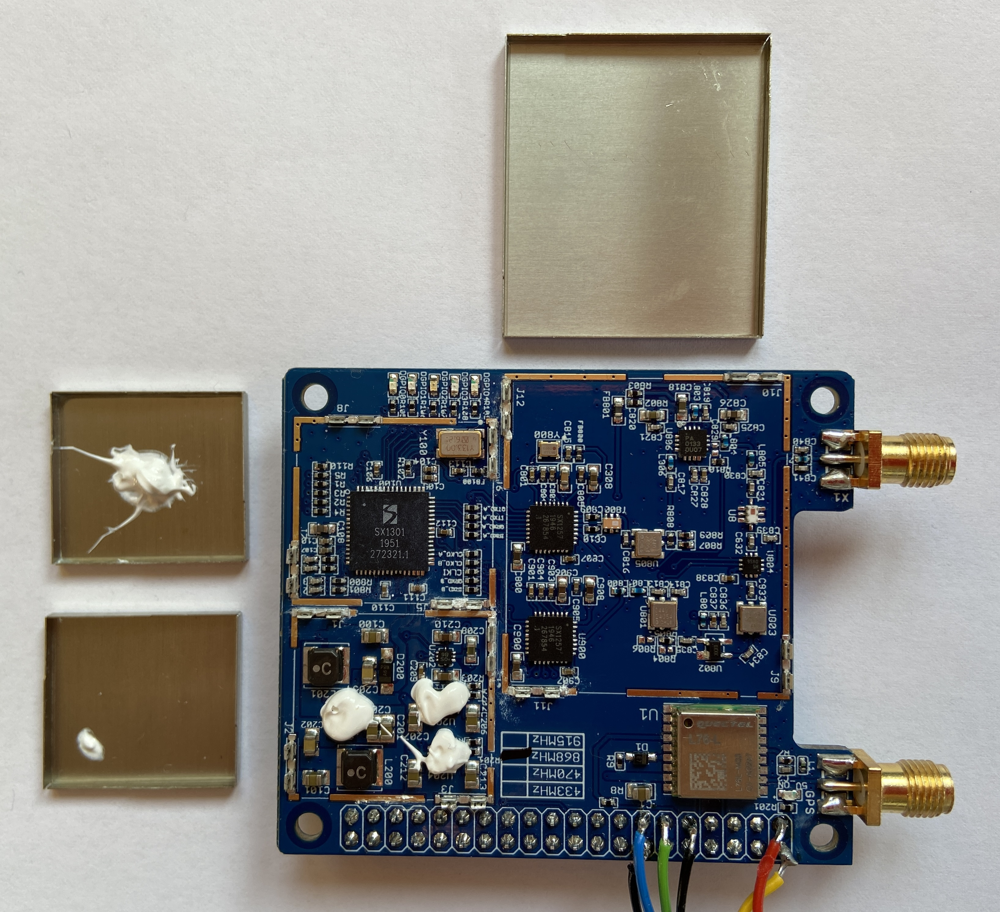
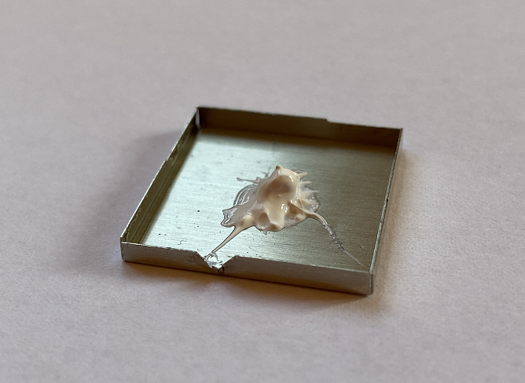
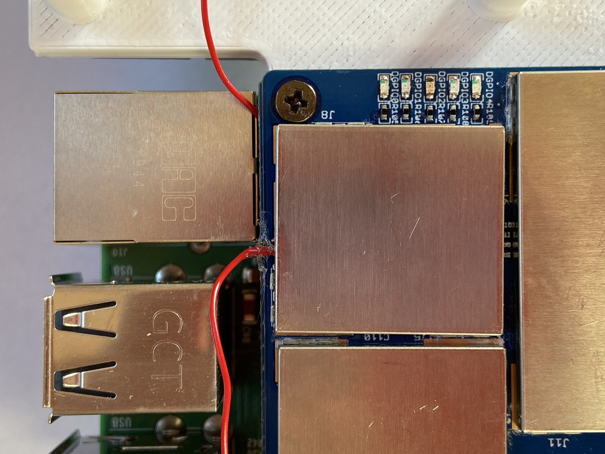
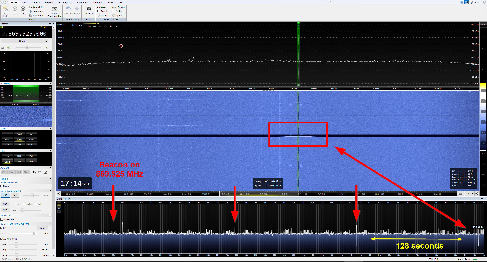
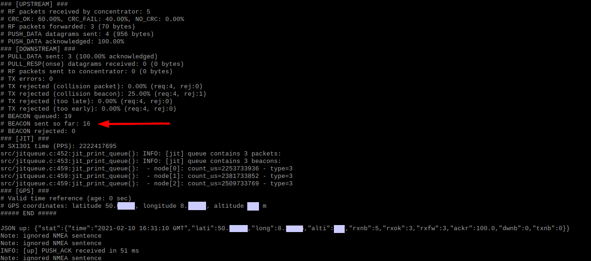
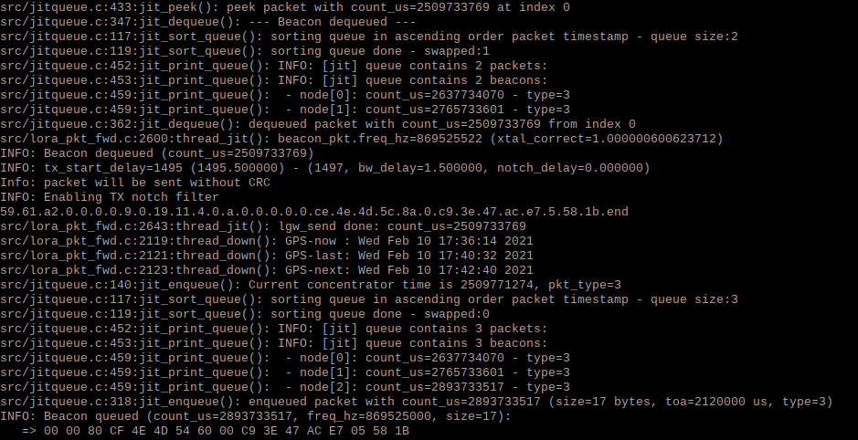

# Dragino PG1301 Concentrator GPS PPS Modification
 Modification of Dragino PG1301 Raspberry Pi Concentrator Gateway for LoRaWAN Class B Support 

## Intro

The Dragino PG1301 consists of a Semtech [SX1301 Baseband Chip](https://www.semtech.com/products/wireless-rf/lora-gateways/sx1301) and two [SX1257 transceiver](https://www.semtech.com/products/wireless-rf/lora-gateways/sx1257) for 868 MHz ISM frequency band. Additionally it has a Quectel L76 GNSS. 

## Board Advantages

The Dragino PG1301 fits perfectly on the Raspberry Pi. It has good RF shielding and a flat top surface which is perfect for mounting large heatsinks.\
It has a SMA connector which has lower attenuation than U.FL pigtail connections.

## What is the problem?

- The original Semtech HAL requires a u-blox GNSS because it needs u-blox proprietary UBX messages for native GPS-Time ([See here](https://github.com/Lora-net/lora_gateway/blob/a955619271b5d0a46d32e08150acfbc1eed183b7/libloragw/src/loragw_gps.c#L282-L286))\
So the onboard Quectel L76 is pretty useless here. 
- The onboard Quectel GNSS PPS pin is routed to pin **#12** of the Raspberry Pi. [See page 6](https://www.dragino.com/downloads/index.php?dir=LoRa_Gateway/PG1301/&file=PG1301_UserManual_v1.0.4.pdf)\
The PPS needs to be connected to the SX1301 Baseband Chip and **not** to the Raspberry Pi. See [SX1301 Datasheet](https://semtech.my.salesforce.com/sfc/p/E0000000JelG/a/44000000MDnR/Et1KWLCuNDI6MDagfSPAvqqp.Y869Flgs1LleWyfjDY) page 26 and schematics below.

## Board View

Below is the Dragino PG1301 concentrator with RF shielding removed.\
Notice the insufficient application of heat sink compound between the RF shields and the chips. The power supply part on the lower left side had not even enough thermal compound to reach the RF shield.\
The SX1301 is the tender spot which needs good cooling. It had more thermal compound applied (removed for picture).\
Both SX1257 transceivers had no heat sink compound applied.

## Modification

Step 1: Disconnect Quectel GPS from Raspberry Pi UART and connect **u-blox 7** or **u-blox NEO M8N** GNSS TX und RX lines to Raspberry Pi. 

Step 2: Connect u-blox GNSS PPS pin to SX1301 Baseband Chip.

### Step 1

Cut both RX and TX lines of Quectel L70 GNSS. If you need them again you can solder wires from the L70 straight to the Raspberry Pi pins.\
As you can see below, the PPS pin is incorrectly connected to pin #12 of Raspberry Pi.

Now you can connect your u-blox NEO M8N or u-blox 7 to these pins.\
(You could also use a USB-to-UART adapter but as the Quectel L70 is useless anyway you can free up the Raspberry Pi pins and don´t waste one USB port.

### Step 2

This step is much more difficult as it requires a very steady hand for soldering a thin wire to the SX1301.\
I used an **AWG 30 size wire** which is about 0.254 mm in diameter; nearly the size of the SX1301 pins.

Be **100% sure** to only solder the wire to **pin #9 PPS IN** and don´t bridge with pin #8 and #10. Pin #10 is GND which easy to find out by measuring resistance. Pin #8 is VDD Logic core supply which is also on pin #60.

You can use both small SMD capacitors to have some kind of horizontal fixation of the wire.  
Because the soldered wire barely holds any mechanical stress, I first secured the other end with adhesive tape on the backside.\
Bend the wire roughly into position prior to soldering.

Modify the RF shield with a small opening for the wire. 

After adding a little more thermal compound on top of the SX1301 I put the RF shield back on.\
Additionally I added a small amount of glue between wire and PCB to have some mechanical fastening.

Make sure to measure resistance between the wire and ground again. **There should be no short circuit!**.

## Attention

Even if the Semtech SX1301 datasheet defines a 10k Ohm resistor between PPS line and ground (see schematics above), the Semtech Packet Forwarder couldn´t be started with the resistor attached.

## After Modification

Every 128 seconds a beacon is emitted on 869.525 MHz. 

